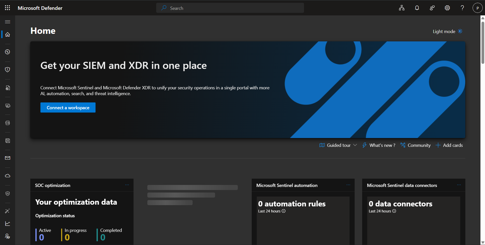
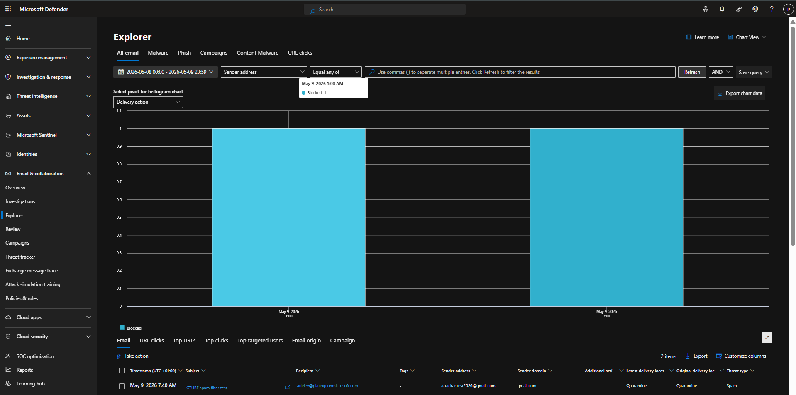
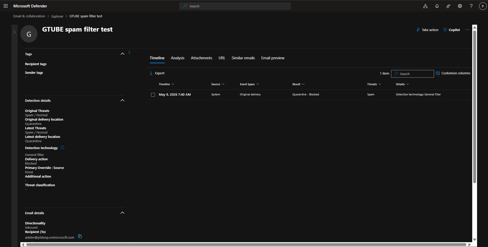
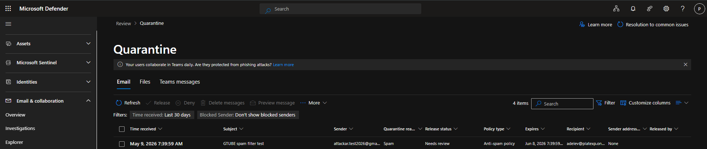
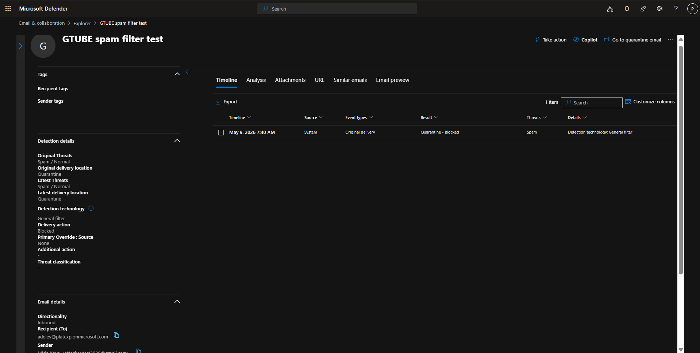

# Mitigating Fraudulent Emails at Contoso
**Configured by:** Preshh | **Tool:** Microsoft Defender for Office 365

---

## Overview
Contoso is a mid-sized organization with 300 users in the US and Western Europe. The company was receiving fraudulent emails in user mailboxes, creating a risk of phishing attacks and data breaches. This project documents the configuration of Microsoft Defender for Office 365 policies to mitigate this risk.

---

## Recommended Plan
**Microsoft 365 Business Premium** — includes Microsoft Defender for Office 365 Plan 1, covering all the security features needed to protect Contoso's 300 users from fraudulent emails.

---

## Pilot Group Strategy
Before rolling out to all 300 users, policies were first applied to a pilot group of 2 users to monitor for false positives and avoid disrupting business communication.

| Pilot User | Role |
|---|---|
| Adele Vance | Represents CEO |
| Pradeep Gupta | Represents CFO |

After 2 weeks of monitoring with no major issues, policies will be rolled out to all 300 users. VIP users (CEO, CFO, CISO) will then be moved to Strict Protection for the highest level of security.

---

## Policies Configured

### 1. Anti-Phishing Policy — Contoso-AntiPhishing-Preshh

This policy protects Contoso users from phishing, impersonation, and domain spoofing attacks.

**Navigating to the Defender dashboard:**

**Navigating to Anti-Phishing policies:**

**Creating a new custom Anti-Phishing policy:**

**Threat Policies main dashboard:**

**Reviewing preset security policy options:**

*Note: Preset policies were reviewed but a custom policy was created instead to allow full control over configuration settings.*

**Applying strict protection settings:**

**Naming the custom policy:**

**Adding pilot group users:**

.png)

**Configuring phishing threshold and protection settings:**

**Adding VIP users to impersonation protection:**

**Final phishing threshold set to 2 - Aggressive:**

Key settings configured:
- Phishing threshold: **2 - Aggressive**
- User impersonation protection: **Enabled** for VIP users
- Domain impersonation protection: **Enabled** for Contoso domain
- Mailbox intelligence: **Enabled**
- Spoof intelligence: **Enabled**
- All safety tips: **Enabled**

**Actions configured for detected threats:**

| Detection | Action |
|---|---|
| User Impersonation | Quarantine — DefaultFullAccessPolicy |
| Domain Impersonation | Quarantine — DefaultFullAccessPolicy |
| Mailbox Intelligence | Move to Junk |
| Spoof (DMARC quarantine) | Quarantine |
| Spoof (DMARC reject) | Reject |

**Policy successfully created:**

---

### 2. Anti-Spam Policy — Contoso-AntiSpam-Preshh

This policy filters spam and bulk emails before they reach Contoso users' inboxes.

**Naming the Anti-Spam policy:**

**Adding pilot group users:**

**Configuring bulk email threshold and spam properties:**

Key settings configured:
- Bulk email threshold: **6**
- All spam score properties: **Enabled**
- All mark as spam properties: **Enabled**
- SPF hard fail detection: **Enabled**
- Backscatter detection: **Enabled**

**Actions configured:**

| Detection | Action | Quarantine Policy |
|---|---|---|
| Spam | Move to Junk | — |
| High Confidence Spam | Quarantine | DefaultFullAccessPolicy |
| Phishing | Quarantine | DefaultFullAccessPolicy |
| High Confidence Phishing | Quarantine | AdminOnlyAccessPolicy |
| Bulk | Move to Junk | — |

Additional settings:
- Retain in quarantine: **30 days**
- ZAP for spam: **Enabled**
- ZAP for phishing: **Enabled**

**Allow and Block list — left empty during pilot phase:**

*Specific senders and domains will be added after reviewing mail flow reports post-pilot.*

**Policy successfully created:**

---

## Mail Flow Reports
To monitor policy effectiveness and share insights with stakeholders:

1. Go to **security.microsoft.com**
2. Navigate to **Reports → Email & Collaboration Reports**

| Report | Purpose |
|---|---|
| Threat Protection Status | Shows phishing and malware caught |
| Mail Flow Summary | Shows volume of inbound and outbound mail |
| Spam Detections | Shows spam trends over time |

Reports can be exported to CSV and shared with stakeholders monthly.

---

## Policy Implications
- **False positives** may occur during pilot phase — users can recover wrongly quarantined emails via DefaultFullAccessPolicy
- **ZAP** automatically removes malicious emails already delivered to inboxes
- **AdminOnlyAccessPolicy** on high confidence phishing ensures only admins can release the most dangerous emails
- After the pilot phase, VIP users will be moved to **Strict Protection** for maximum security

---

## Policy Testing

To verify the Anti-Spam policy was working correctly, a GTUBE standard spam test email was sent from a test Gmail account to pilot user Adele Vance.

**Test Email Details:**
- **Sender:** Attacker test Gmail account
- **Recipient:** AdeleV@platexp.onmicrosoft.com
- **Subject:** GTUBE spam filter test

**Threat Explorer — Test email detected:**

**Test email details in Threat Explorer:**

| Result | Value |
|---|---|
| Detection Technology | General Filter |
| Delivery Action | Original Delivery |
| Result | Quarantine |
| Status | Blocked |

**Test email confirmed in Quarantine:**

**Quarantine email details:**

**Conclusion:** The Contoso Anti-Spam policy successfully detected and quarantined the spam test email, confirming the policy is working exactly as configured. The email never reached Adele Vance's inbox.

*Configured by Preshh | Microsoft Defender for Office 365 | Contoso Email Security Project*
